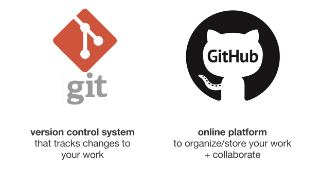
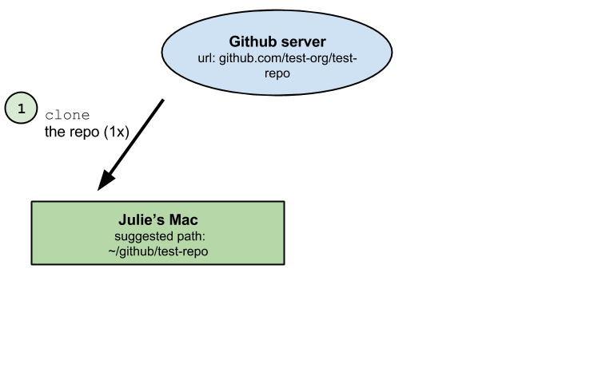
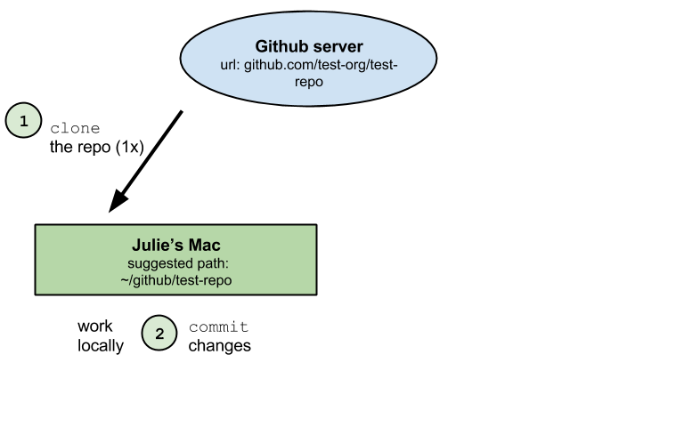
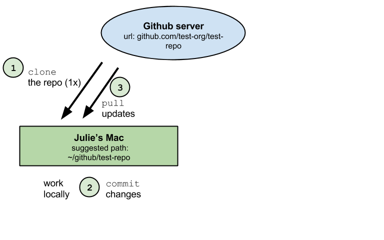

## What is GitHub?  
<!---To view rendered .html files, preappend http://htmlpreview.github.io/? to the url--->
<!---Make notes or comments that won't be rendered using this syntax--->

[**GitHub**](https://github.com) is an open-source development platform that enables easy collaboration and versioning, which means that all saved versions are archived and attributed to each user. It is possible to revert back to any previous version, which is incredibly useful to not only to document what work has been done, but how it differs from work done in the past, and who is responsible for the changes. Great for collaborators and your future self.

## What is GitHub?  

[**GitHub**](https://github.com) is an open-source development platform that enables easy collaboration and versioning, which means that all saved versions are archived and attributed to each user. It is possible to revert back to any previous version, which is incredibly useful to not only to document what work has been done, but how it differs from work done in the past, and who is responsible for the changes. Great for collaborators and your future self.

Similar to Dropbox, you have certain folders on your local computer that will be 'watched', with any changes able to be synced online. However, with GitHub, you have more control about what is synced, and how often. You can store, share, track changes and collaboratively edit many filetypes (including this [presentation](https://github.com/eco-data-science/github-intro/blob/master/index.rmd)!) using any application. There are many other great features, including a to-do list you can share with collaborators (called Issues). 

## git and GitHub

  
Git is distinct from GitHub, but this is not the focus today.  
  
(definition from [GitHub.com](https://guides.github.com/introduction/getting-your-project-on-github))

## Why use GitHub?  

There are so many reasons to use GitHub. Personal organization, switching between your home and work computers, backing up, version control. Also for collaboration, sharing, learning, contributing. . .

Nicely explained by Hadley Wickham: [Git and GitHub Tutorial](https://github.com/rstudio/webinars/blob/master/06-Collaboration-and-time-travel-version-control/git-github.pdf) 

And also by Karl Broman: [GitHub Tutorial](http://kbroman.org/github_tutorial/pages/why.html)

And also by Ben Best: [ds-git Tutorial](http://htmlpreview.github.io/?https://github.com/eco-data-science/ds-git/blob/gh-pages/index.html)

## Workshop Outline

1. GitHub Structure
2. GitHub Workflow and Vocabulary
3. Best Practices
4. Syncing Options 
5. Workflow and Practice
6. Resources

## GitHub Structure

Files are stored in **repositories**, owned by **users** / **organizations**.  

Repositories ('repos') are essentially folders containing files pertaining to a specific project. Repositories are version controlled so that any modifications to files, additions or deletions, are tracked and attributed to contributors with the correct permissions. 

## GitHub Structure

Files are stored in **repositories**, owned by **users** / **organizations**.  

Repositories ('repos') are essentially folders containing files pertaining to a specific project. Repositories are version controlled so that any modifications to files, additions or deletions, are tracked and attributed to contributors with the correct permissions. 

Same structure across all orgs/repos: familiar, easy to navigate. 

*Let's explore a bit:*

* **repositories**: [github-intro](https://github.com/eco-data-science/github-intro), [dplyr](https://github.com/hadley/dplyr), [ggplot2]() 
* **users**: [jules32](https://github.com/jules32), [hadley](https://github.com/hadley), [jennybc](https://github.com/jennybc)
* **organizations**: [twitter](https://github.com/twitter), [netflix](https://github.com/netflix), [rstudio](https://github.com/rstudio), [nceas](https://github.com/nceas), [ohi-science](https://github.com/ohi-science)

## GitHub Workflow and Vocabulary

* **clone**: download to your computer from online version with syncing capabilities enabled

## GitHub Workflow and Vocabulary

* **commit**: message associated with your changes ([best practices](http://r-pkgs.had.co.nz/git.html#commit-best-practices))

## GitHub Workflow and Vocabulary

* **pull**: sync a repo on your computer with the online version. Do this frequently.

## GitHub Workflow and Vocabulary

* **push**: sync the online repo with your version, only possible after committing

## GitHub Workflow and Vocabulary

**sync ~ pull + commit + pull + push**  
All collaborators work independently but sync regularly

## GitHub Workflow: fork and pull

**fork + pull + commit + push + pull request**

## GitHub Workflow: branches and issues

[guides.github.com/introduction/flow](https://guides.github.com/introduction/flow)
  

## Best Practices

**Pull often!**

**Commit frequently** 

**Be mindful of filepaths**

* We work from a in a folder in our home directory called ***'github'*** (all lowercase!), so that everyone can access the repo with the filepath beginning in `~/github`:

* **Windows**: `Users\[User]\Documents\github\`
* **Mac**: `Users/[User]/github/`

## Syncing Options

**On GitHub.com**, you can clone a repo to your computer.  

**On your computer**, you can clone/sync repos in several ways: 

* [**GitHub Desktop**](https://desktop.github.com/)
* [**RStudio**](www.rstudio.com)
* **shell/command line**

When you work on your computer, any edits you make to any files in your repo, using any program, will be tracked. 

## Creating new repos

**On GitHub.com**, you can create new repos

**On your computer**, you can create new repos in several ways: 

* [**GitHub Desktop**](https://desktop.github.com/)
* [**RStudio**](www.rstudio.com)
* **shell/command line**

 
## Workflow and Practice Using RStudio

1. **fork a repo** to your user account
2. **clone the repo** to your computer
3. **edit a file**, inspect differences
4. **commit** changes
5. **pull**
6. **push**
7. repeat!

## GitHub and science (and beyond)

- [GitHub gets its science on](http://readwrite.com/2014/05/15/github-science-doi-academia-repository)
- [Making your code citable](https://guides.github.com/activities/citable-code/)
    - [Choosing an open source license](https://github.com/blog/1530-choosing-an-open-source-license)
    

  
  
- [Ways to use GitHub that aren't coding](http://readwrite.com/2013/11/08/seven-ways-to-use-github-that-arent-coding)

## Resources

**Learn more about GitHub:**

* [**GitHub Guides**](https://guides.github.com/) by GitHub  
  
  
* [**Git and GitHub**](http://r-pkgs.had.co.nz/git.html) by Hadley Wickham
* [**Good Resources for Learning Git and GitHub**](https://help.github.com/articles/good-resources-for-learning-git-and-github/) by GitHub
* [**Learn Git Branching**](http://pcottle.github.io/learnGitBranching/) by Peter Cottle
* [**Git/GitHub Guide**](http://kbroman.org/github_tutorial/) by Karl Broman 
* [**Git & GitHub**](http://htmlpreview.github.io/?https://github.com/eco-data-science/ds-git/blob/gh-pages/index.html) by Ben Best

Just Google 'GitHub Tutorial...'

