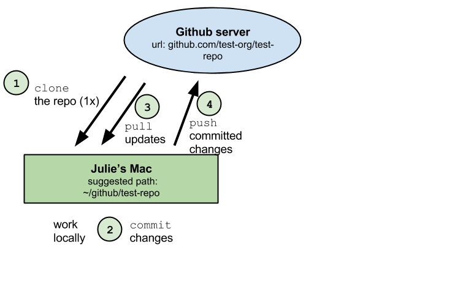
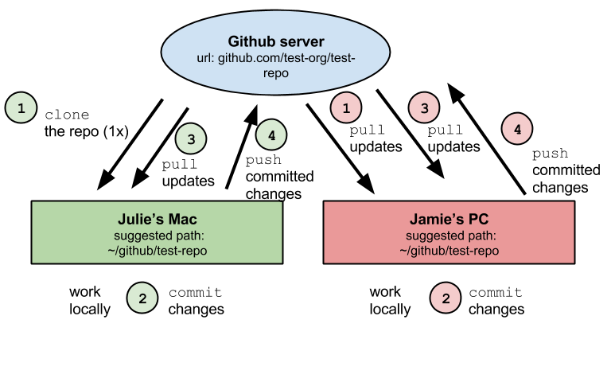
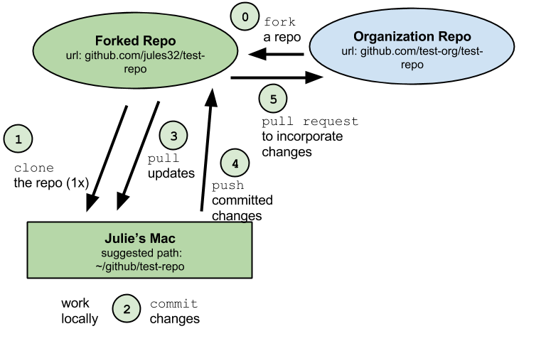

## What is GitHub?  
<!---To view rendered .html files, preappend http://htmlpreview.github.io/? to the url. See http://htmlpreview.github.io/ for details--->
<!---Make notes or comments that won't be rendered using this syntax--->

[**GitHub**](https://github.com) is an open-source development platform that enables easy collaboration and versioning, which means that all saved versions are archived and attributed to each user. It is possible to revert back to any previous version, which is incredibly useful to not only to document what work has been done, but how it differs from work done in the past, and who is responsible for the changes.

Similar to Dropbox, you have certain folders on your local computer that will be synched online, although you have more control about the synching. You can store, share, track changes and collaboratively edit many filetypes (including this [presentation](https://github.com/eco-data-science/github-intro/blob/master/index.rmd)!), using any program to edit, and can use a shared to-do list (called Issues). 

## Why use GitHub?  

There are so many reasons to use GitHub. Personal organization, switching between your home and work computers, backing up, version control. Also for collaboration, sharing, learning, contributing. . .

Nicely explained by Hadley Wickham in his  [Git and GitHub Tutorial](https://github.com/rstudio/webinars/blob/master/06-Collaboration-and-time-travel-version-control/git-github.pdf) 

And also by Karl Broman in his [GitHub Tutorial](http://kbroman.org/github_tutorial/pages/why.html)

And also by Ben Best in his [ds-git Tutorial](http://htmlpreview.github.io/?https://github.com/eco-data-science/ds-git/blob/gh-pages/index.html)

## Resources

**Learn more about GitHub:**

* [**Git and GitHub**](http://r-pkgs.had.co.nz/git.html) by Hadley Wickham
* [**Good Resources for Learning Git and GitHub**](https://help.github.com/articles/good-resources-for-learning-git-and-github/) by GitHub
* [**Learn Git Branching**](http://pcottle.github.io/learnGitBranching/) by Peter Cottle
* [**Git/GitHub Guide**](http://kbroman.org/github_tutorial/) by Karl Broman 
* [**Git & GitHub**](http://htmlpreview.github.io/?https://github.com/eco-data-science/ds-git/blob/gh-pages/index.html) by Ben Best

* [**Hello World GitHub Guide**](https://guides.github.com/activities/hello-world/), a 10-minute tutorial by GitHub

Just Google 'GitHub Tutorial...'

## Workshop Outline

1. GitHub Structure
2. GitHub Vocabulary
3. GitHub Workflow
4. Best Practices
5. Cloning and Synching Options 
6. Workflow demo using RStudio
7. Practice

## GitHub Structure

GitHub stores files in **repositories**, owned by an **organization**.  

Repositories ('repos') are essentially folders containing files pertaining to a specific project. Repositories are version controlled so that any modifications to files, additions or deletions, are tracked and attributed to contributors with the correct permissions. 

* [eco-data-science](https://github.com/eco-data-science) is an **organization**
* [github-intro](https://github.com/eco-data-science/github-intro) is a **repository**

*Let's navigate through a github repo: [eco-data-science/github-intro](https://github.com/OHI-Science/github-intro)*

## GitHub Vocabulary

All collaborators will work locally on their own computers, syncing their changes back online so others work from the most current version.

* **clone**: download to your computer from online version with synching capabilities enabled
* **commit**: message associated with your changes (see some [best practices](http://r-pkgs.had.co.nz/git.html#commit-best-practices))
* **pull**: sync a repo on your computer with online version
* **push**: sync the online repo with your version, only possible after committing

**sync ~ pull + commit + push**

## GitHub Workflow

**sync ~ pull + commit + pull +push**

## GitHub Workflow

**sync ~ pull + commit + pull + pull + push**

## GitHub Workflow: fork and pull

**fork + pull + commit + push + pull request**

## Best Practices

**Pull often!**

**Commit frequently** 

**Be mindful of filepaths**

We work from a in a folder in our home directory called ***'github'*** (all lowercase!), so that everyone can access the repo with the filepath `~/github`. 

* **Windows**: `Users\[User]\Documents\github\`
* **Mac**: `Users/[User]/github/`

*Please make a `github` folder in your home directory.*

## Cloning and Synching Options

You will clone a repository to your computer so you can work offline. 

When you work on your computer, any edits you make to any files in your repo, using any program, will be tracked by GitHub. You can then commit and sync your changes back to GitHub. There are many options you can use to first clone and then sync your edits on a repo with the online version:

* **GitHub App** [for Mac](https://mac.github.com/) and [for Windows](https://windows.github.com/)
* [**RStudio**](www.rstudio.com)
* **shell (Terminal on Mac)**

*We will just use RStudio today.*
 
## Workflow demo using RStudio

1. **fork a repo**
2. **clone a repo**
3. **edit a file**: [test_script_ohi-uswest.Rmd](https://github.com/eco-data-science/github-intro/blob/master/sandbox/test_script_ohi-uswest.Rmd)
4. **commit**
5. **pull**
6. **push**

## Practice

If you haven't already (you can refer to the [OHI Manual](http://ohi-science.org/manual/#installing-the-toolbox)): 

1. Create a [GitHub](http://github.com) account 
2. Download and install [*git*](http://git-scm.com/downloads) software, set up your git identity
3. Email your GitHub username to lowndes@nceas.ucsb.edu
4. Create a folder called  ***github*** on your computer
5. Clone [github-intro](https://github.com/eco-data-science/github-intro) repository to your computer

## Practice

Now: 

1. Pull, or fork to your repo and pull
2. Edit [test_script_ohi-uswest.Rmd](https://github.com/eco-data-science/github-intro/blob/master/sandbox/test_script_ohi-uswest.Rmd) in RStudio
3. Commit changes
4. Pull
5. Push
6. Repeat!

